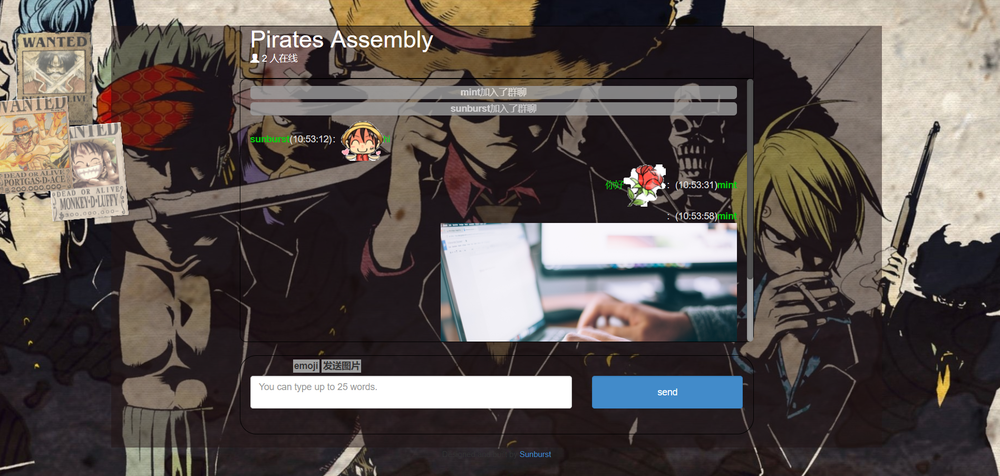

# WebChat
在网上搜索了一些资料自己利用Node.js与socket.io搭建了一个属于自己的web聊天室，因为很喜欢动漫海贼王所以加入了一些onepiece的元素。

### 已完成功能

- 支持键盘回车发送信息
- 支持图片发送
- 支持表情发送
- 支持在线用户统计和用户列表

### 待完成功能

- 加入用户头像等

- 清除聊天记录
- 创建新的聊天室
- 单用户的链接与私聊功能
- 数据保存至数据库
- 在线机器人客服 
- 坑有些多，可能得自己找到实习工作以后

**下图为效果预览：**

### 本地运行方法

- 下载安装依赖

  > npm install

- 启动服务器

  > node server.js 

- 最后打开浏览器访问`localhost:8086`