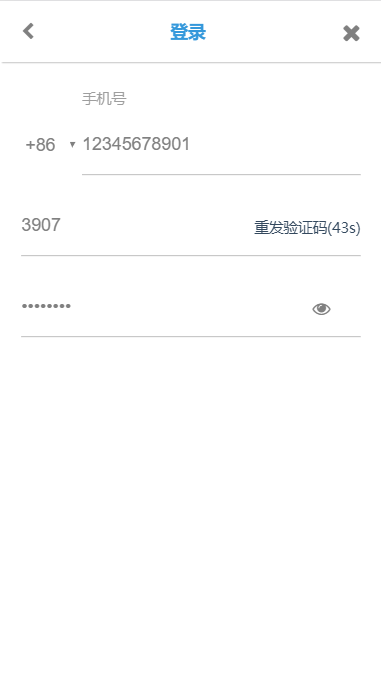
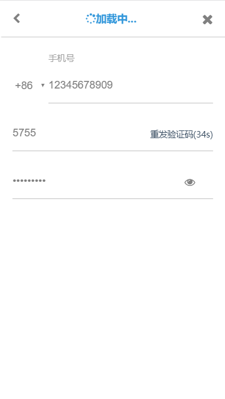

# 面试题：一个带验证码倒计时功能的登录组件

## 介绍

利用Vue.js与Font Awesome图标完成的带验证码倒计时功能的登录组件

## 业务要求

1. 对手机号进行校验
2. 在手机号正确的情况下才允许发送验证码
3. 验证码需要调用远程接口获取（get） - [验证码API](https://easy-mock.com/mock/5b2385e3debe3c5977248a16/wscn/captcha)
4. 获取验证码之后将验证码自动回塞
5. 验证码倒计时组件以秒为基本单位
6. 验证码倒计时组件60内不可重复点击，失败则可重试
7. 最后将手机号与验证码一同发送到提交接口（post） - [提交API](https://easy-mock.com/mock/5b2385e3debe3c5977248a16/wscn/submit)

## 预览

## 测试

- 连续点击登录框时会报错 `Unexpected token S in JSON at position 0`

> debug: 查看了一下network的返回信息  Sometimes You Just Have to Slow Down.意思是数据请求太频繁。所以当后端返回这段字符串时，数据格式不再是json，所以会报这个错误。考虑到题目中建议添加loading效果，就采用了最简单的实现方式。当用户点击登录选项时，显示loading...等接收到请求数据再显示登录字样。这样用户看到加载过程也不会重复点击。（更好的实现方法应该是对fetch的请求状态或数据格式做不同处理或者是用函数节流）

## 思考

- 登录表单不能只提交手机号与验证码，而不对密码进行验证。
- 只在前端对发送验证码的频率进行限制并不完全有效，刷新页面就可以跳过倒计时。
- 即使是用localstorage对用户的登录状态进行存储也一样，利用开发者工具也可以进行清空。要想完全实现理想的重发验证码倒计时功能，还是一定要和后端配合。
- 登录组件虽然功能简单，但可优化的细节还是听过的。比如输入值的验证、自定义参数、请求超时的提示。但考试周时间紧迫，只能暂时先把基本功能实现。