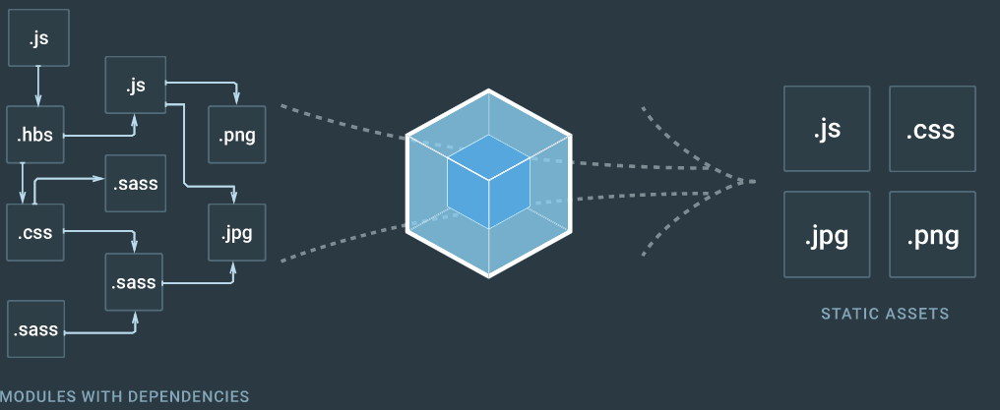
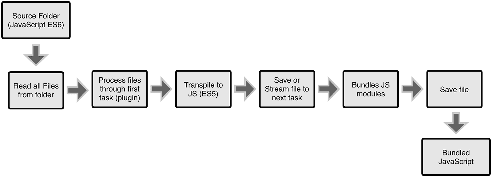
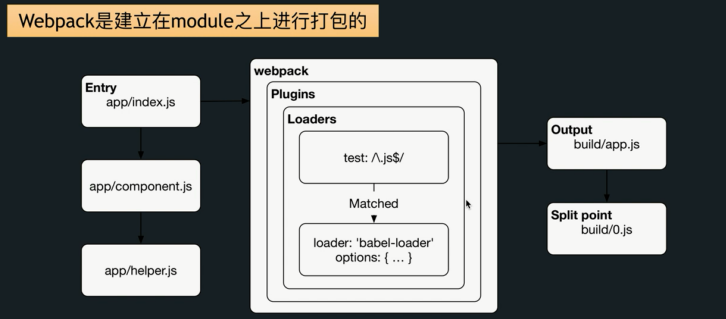
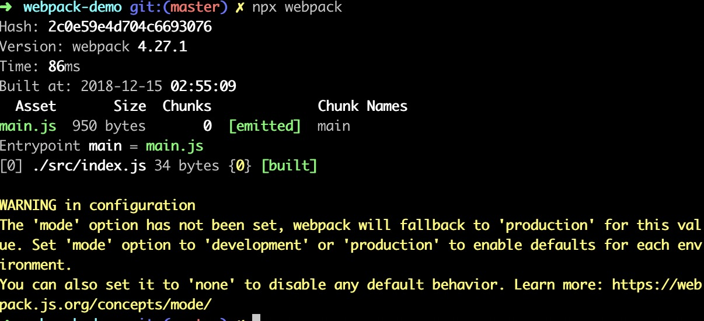

## 什么是Webpack？

自从出现模块化以后，我们可以将原本一坨代码分离到个个模块中，但是由此引发了一个问题。每个 JS 文件都需要从服务器去拿，这样会导致页面加载速度变慢。Webpack 最主要的目的就是为了解决这个问题，将所有小文件打包成一个或多个大文件，官网的图片就很好的诠释了这个事情。




**WebPack是一个现代 JavaScript 应用程序的静态模块打包器(module bundler)：**

它会分析你的项目结构，找到JavaScript模块以及其它的一些浏览器不能直接运行的扩展语言(如ES6、TypeScript、Sass等)，将其转换和打包为合适的格式后供浏览器使用。

## Webpack有什么作用？

当 webpack 处理应用程序时，它会递归地构建一个依赖关系图(dependency graph)，其中包含应用程序需要的每个模块，然后将所有这些模块打包成一个或多个 bundle。

构建就是把源代码转换成发布到线上可执行的 JavaScript、CSS、HTML 代码，包括以下内容：

- **代码转换**：TypeScript 编译成 JavaScript、SCSS 编译成 CSS 等
- **文件优化**：压缩 JavaScript、CSS、HTML 代码，压缩合并图片等
- **代码分割**：提取多个页面的公共代码、提取首屏不需要执行部分的代码让其异步加载
- **模块合并**：在采用模块化的项目有很多模块和文件，需要构建功能把模块分类合并成一个文件
- **自动刷新**：监听本地源代码的变化，自动构建，刷新浏览器
- **代码校验**：在代码被提交到仓库前需要检测代码是否符合规范，以及单元测试是否通过
- **自动发布**：更新完代码后，自动构建出线上发布代码并传输给发布系统

 构建其实是工程化、自动化思想在前端开发中的体现。把一系列流程用代码去实现，让代码自动化地执行这一系列复杂的流程。

## webpack的基本概念

**[入口(entry point)](https://link.juejin.im/?target=https%3A%2F%2Fwww.webpackjs.com%2Fconcepts%2Fentry-points%2F)**

指示 webpack 应该使用哪个模块，来作为构建其内部依赖图的开始，webpack 会找出有哪些模块和 library 是入口起点（直接和间接）依赖的。

> 默认值是 `./src/index.js`，然而，可以通过在 webpack 配置中配置 entry 属性，来指定一个不同的入口起点（或者也可以指定多个入口起点）。

**[出口(output)](https://link.juejin.im/?target=https%3A%2F%2Fwww.webpackjs.com%2Fconcepts%2Foutput%2F)**

告诉 webpack 在哪里输出它所创建的 bundles，以及如何命名这些文件。

> 主输出文件默认为 `./dist/main.js`，其他生成文件的默认输出目录是 `./dist`

**[加载器(loader)](https://link.juejin.im/?target=https%3A%2F%2Fwww.webpackjs.com%2Fconcepts%2Floaders%2F)**

让 webpack 能够去处理那些非 JavaScript 文件（webpack 本身只能加载 JavaScript/JSON模块）。loader 可以将所有类型的资源文件转换为 webpack 能够处理的有效模块，然后你就可以利用 webpack 的打包能力，对它们进行处理。

> loader本身是一个函数，接受源文件作为参数，返回转换后的结果。注意，loader 能够 import 导入任何类型的模块（例如 .css 文件），这是 webpack 特有的功能，其他打包程序或任务执行器的可能并不支持。我们认为这种语言扩展是有很必要的，因为这可以使开发人员创建出更准确的依赖关系图。

[插件(plugins)](https://link.juejin.im/?target=https%3A%2F%2Fwww.webpackjs.com%2Fconcepts%2Fplugins%2F)

loader 被用于转换某些类型的模块，而插件则可以用于执行范围更广的任务。插件的范围包括，从打包优化和压缩，一直到重新定义环境中的变量。插件接口功能极其强大，可以用来处理各种各样的任务。

> 常用插件：
>
> - CleanWebpackPlugin：自动清除指定文件夹资源
> - HtmlWebopackPlugin：根据模板自动生成html并引入script脚本
> - UglifyJSPlugin：压缩JS代码

**[模式(mode)](https://link.juejin.im/?target=https%3A%2F%2Fwww.webpackjs.com%2Fconcepts%2Fmode%2F)**

通过选择 `development` 开发环境或 `production` 生产环境之中的一个，来设置 mode 参数，从而启用相应模式下的 webpack 内置的优化。

> 简单来说，开发时可能需要打印 debug 信息，还有定义 `sourcemap` 、`UglifyJSPlugin`文件，而生产环境是用于线上的即代码都是压缩后，运行时不打印 debug 信息等。譬如 axios、antd 等我们的生产环境中需要使用到那么我们应该安装该依赖在生产环境中，而 `webpack-dev-server` 则是需要安装在开发环境中。

**webpack 构建过程：**

1. 从 Entry 里配置的 Module 开始递归解析 Entry 依赖的所有 Module。
2. 每找到一个 Module， 就会根据配置的 Loader 去找出对应的转换规则。
3. 每找到一个 Module， 就会根据配置的 Loader 去找出对应的转换规则。
4. 这些模块会以 Entry 为单位进行分组，一个 Entry 和其所有依赖的 Module 被分到一个组也就是一个 Chunk(编码块)。
5. 最后 Webpack 会把所有 Chunk 转换成文件输出。
6. 在整个流程中 Webpack 会在恰当的时机执行 Plugin 里定义的逻辑。


## WebPack VS Grunt/Gulp？

**其实Webpack和另外两个并没有太多的可比性，Gulp/Grunt是一种能够优化前端开发工作流程的工具，而WebPack是一种模块化的解决方案，不过Webpack的优点使得Webpack在很多场景下可以替代Gulp/Grunt类的工具。**

### Grunt和Gulp的工作方式

在一个配置文件中，指明对某些文件进行类似编译，组合，压缩等任务的具体步骤，这个工具之后可以自动替你完成这些任务。




### Webpack的工作方式

把你的项目当做一个整体，通过一个给定的主文件（如：index.js），Webpack将从这个文件开始找到你的项目的所有依赖文件（如：component.js 、helper.js ），然后将这些模块使用不同的loaders（第三方包）来处理它们，最后打包为一个浏览器可识别的JavaScript文件。（如：app.js）




## 使用Webpack搭建前端开发环境

在明白了Webpack的概念之后，我们现在一步步的开始简单的使用Webpack4.0+搭建基本的前端开发环境。

主要包括以下几个方面：

- 构建发布需要的 HTML、CSS、JS、图片等资源
- 配置 babel 转码器， 使用 es6+语法
- 使用 CSS 预处理器，这里使用 less
- 处理和压缩图片
- 配置热加载，HMR

### 安装命令

```bash
1、卸载默认： 
npm uninstall webpack

2、全局安装：不推荐，会将你项目中的 webpack 锁定到指定版本，并且在使用不同的 webpack 版本的项目中，可能会导致构建失败。
npm install webpack -g

3、局部安装： 4.0及以上还需要安装 webpack-cli（此工具用于在命令行中运行 webpack）
npm install webpack webpack-cli --save-dev
// 将 webpack 和 webpack-cli 放入项目开发环境依赖中
```

### 准备工作

```bash
1. 新建一个空的练习文件夹
mkdir  webpack-demo && cd webpack-demo

2. 创建 package.json npm的说明文件
// 包括当前项目的基本信息，依赖模块，自定义的脚本任务
npm init 
// 这里会问一些问题，可以直接回车跳过或者 npm init -y

3. 局部安装
npm i webpack webpack-cli -D
```

### 默认零配置

从webpack v4.0.0 开始可以一个配置文件都不写，实现零配置。

首先创建webapck默认的开发阶段的src文件夹用来存放项目源代码，以及项目入口文件index.js。

```cmd
cd webpack-demo
mkdir src && cd src
touch index.js
```

在终端执行`npx webpack`，发现webpack已经把src/index.js文件打包到了dist目录 mian.js 文件里。



**关于如何运行webpack:**

- 这里直接执行webpack会提示command not found: webpack，这是因为我们没有将webpack以及webpack-cli进行全局安装。
- 而项目内安装的webpack实际上执行的是 node_modules 目录下 .bin 目录内的 webpack.js 脚本，所以直接使用`node ./node_modules/.bin/webpack`就可以启动webpack。
- 而这里使用的是更简单的方式就是通过npm的包执行器npx，`npx command` 默认就是执行 `./node_modules` 目录中安装的可执行脚本。如果webpack未安装，它也会自动从npm源下载安装后再执行。
- 但是这样在4.0版本的webpack中，终端会出现未定义构建模式的WARNING，所以最好的方式是在package.json的 scripts 里添加一个`"build": "webpack --mode production"`(默认production)后使用 `npm run build` 来运行webpack。


### 自定义配置文件

实际情况下大多数项目都会需要很复杂的设置，而要想对 webpack 中增加更多的配置信息，我们需要在根目录下创建webpack 的配置文件 `webpack.config.js` 。再执行 npm run build，webpack 就会使用我们在这个配置文件里定义的配置信息了。

```cmd
cd webpack-demo
touch webpack.config.js
```

Webpack.config.js中常用的基本配置信息：

```javascript
module.exports = {
  entry: '', // 打包入口：指示 webpack 应该使用哪个模块，来作为构建其内部依赖图的开始
  output: '', // 出口目录
  mode: 'development', // 在这里更改了模式，就不必在package.json里再设置 --mode
  resolve: {}, // 配置解析：配置别名、extensions 自动解析确定的扩展等等
  devServer: {}, // 开发服务器：run dev/start 的配置，如端口、proxy等
  module: {}, // 模块配置：配置loader（处理非 JavaScript 文件，比如 jsx、sass、vue、图片等等）
  plugins: [] // 插件配置：打包优化、资源管理和注入环境变量
}
```


### 配置打包入口和出口

```JavaScript
// 引入webpack自带的node核心模块
const path = require('path')

module.exports = {
    // 页面入口 js 文件
    entry:  './src/index.js',
    
    // 配置打包输出相关
    output: {
      // 打包输出目录，必须使用绝对地址，输出文件夹路径
      path: path.resolve(__dirname, 'dist'), // 解析路径为 ./dist
      // 入口 js 的打包输出文件名，默认为 main.js
      filename: "bundle.js" 
    }
  }
```

也可以使用下面的写法：

```javascript
const path = require('path')

// 重新配置入口文件路径以及出口文件路径
const PATH = {
    app:path.join(__dirname, "./src/index.js"),
    build:path.resolve(__dirname, "./dist")
}

module.exports = {
    entry:{
        //这里面的key值决定了下面name的名字叫什么
        app:PATH.app
    },
    output:{
        path:PATH.build,
        filename:"[name].js" // 即app.js
    }
  }
```

> - path.join() 将第一个参数和第二个参数进行链接(路径连接)，该方法的主要用途在于，会正确使用当前系统的路径分隔符，Unix系统是 /，Windows系统是 \。
> - path.resolve() 会把一个路径或路径片段的序列参数解析为一个绝对路径， 也可以变成相对路径。
> - __dirname：当前文件夹的绝对路径。


### 使用 html-webpack-plugin 创建 html 文件

在此之前我们在 src 文件夹下只创建了入口文件 index.js，所以如果我们要引用打包后的 app.js 那么还要在 src 下创建一个 index.html入口页面文件，并正确引用打包后的文件。

```html
<script src="../dist/app.js"></script>
```

但更多情况下，如果我们有多个入口页面或要打包的模块，我们不希望打包一次，就新建一次 html 文件来引用打包后的文件，这样显得不智能或者当我们修改打包输出的文件名后，html里的引用路径就会出错。

这时我们可以使用 [html-webpack-plugin](https://link.juejin.im/?target=https%3A%2F%2Fwebpack.docschina.org%2Fplugins%2Fhtml-webpack-plugin%2F) 插件来生成html文件，并将 HTML 引用路径和我们的构建结果关联起来。

安装：

`npm install html-webpack-plugin -D`

修改 webpack.config.js 文件：

```javascript
const HtmlWebpackPlugin = require('html-webpack-plugin')
module.exports = {
  //...
  plugins: [new HtmlWebpackPlugin()]
}
```

重新执行 npm run build 这将会产生一个包含以下内容的文件 `dist/index.html`：

```html
<!DOCTYPE html>
<html>
  <head>
    <meta charset="UTF-8">
    <title>webpack App</title>
  </head>
  <body>
    <script type="text/javascript" src="app.js"></script>
  </body>
</html>
```

### 打包CSS文件

我们希望使用 webpack 来进行构建 css 文件，为此需要在配置中引入 loader 来解析和处理 CSS 文件。

安装：

`cnpm install style-loader css-loader -D`


