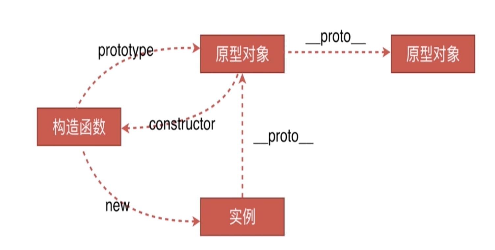
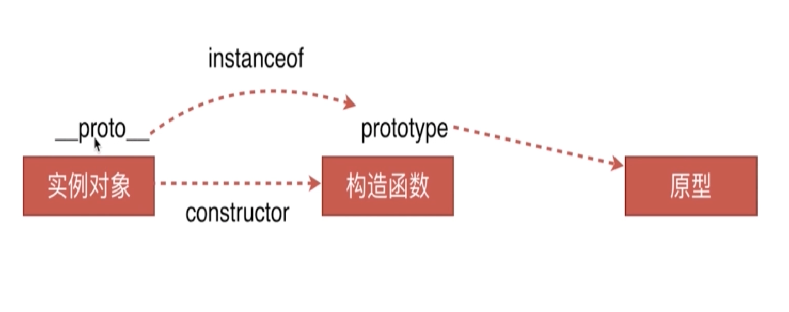
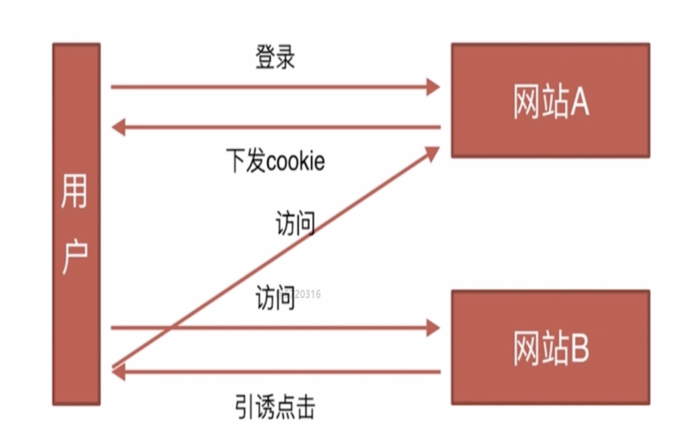
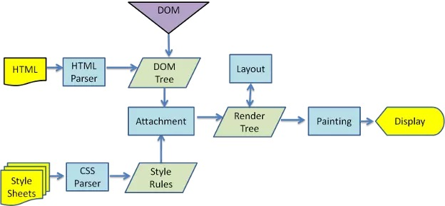

# 前端面试技巧

### JD描述分析

**任职要求：**

1. 具有前端架构分析与设计能力，一贯坚持编写易读，易维护、高质量、高效率的代码，习惯于OOP开发方式。

   > - 项目的目录结构设计、复用性设计、模块化设计、自动化测试、上线流。这些方面都要分析考虑周到，才能具有架构分析与设计的能力。
   > - 笔试写代码时，一定要坚持好的编码习惯。每个函数的功能要单一，能抽象的尽量抽象。

8. 熟悉web构建工具 Grunt、Gulp、能够自己搭建前端构建环境。

   > - 熟悉使用Gulp构建工具，要知道Grunt和Gulp有什么区别。

9. 有服务端(不限语言)开发经验者优先。

   > - 了解即可，既然前面没有提到对服务端的要求，不用可以去学Node.js给自己挖坑。

#### 艺龙前端职位描述分析

**职位描述：**

1. 负责艺龙酒店业务前端开发，使用系统化设计提高开发效率。

   > - 说法比较笼统，系统化设计提高开发效率其实就是模块化设计以及前后端分离(客户端渲染)

2. 负责推广运营活动的html5、采用canvas、css3、JS 相关前端技术。

   > - 没有明确指出html5页面是放在PC还是移动端，但是明确了canvas和css3做动画的技术点。
   > - 对动画应该会有一定的要求，所以起码应该了解画图相关的API、animation、transition、还有动画帧和GPU加速。

3. 负责艺龙微信项目。

   > - 微信小程序相关开发文档以及组件化的东西、微信支付等微信开发中常见的技术点。

4. 艺龙前端框架的开发和维护，协助业务方解决应用问题。

   > - 熟悉框架、组件化开发设计。

**任职要求：**

1. 精通各种Web前端技术，包括HTML/CSS/JavaScript等，3年以上工作经验。

2. 深刻理解Web标准，对可用性、可访问性等相关知识有实际的了解和实践经验。

   > - 对网站错误及性能相关方面的监控，捕获 JS 异常(JS运行异常、资源加载错误)

3. 熟练使用工程化工具，熟悉webpack、grunt、sass优先。

4. 具有良好的代码风格、接口设计与程序架构。

5. 至少熟悉一门非Web前端脚本的语言(如 Java / Python) 或Node.js，有实践经验。

6. 个性乐观开朗、逻辑性强、善于和各种背景的人合作。

### 技术栈准备

#### 前端技术核心

**Angular、Vue、React**

1. 根据自己的兴趣准备其中的一两个框架，并深入理解掌握其中一个。
2. 阅读源码：不建议自己阅读，找一些高质量的文章跟着学习。 
3. 项目实战：在写项目的过程中积累遇到过的问题，以及面试中常见的坑可以在社区论坛中找到解决方案。

**Node.js**

1. 如果没有了解过就选择不要在简历中出现Node.js，避免给自己挖坑。
2. 如果自己能够有一定的了解，则可以成为面试的加分项。

### 自我介绍

#### 简历

1. 基本信息：姓名、年龄、手机、邮箱、籍贯（照片几乎不需要）
2. 学历：只保留最高学历即可
3. 工作经历：时间-公司-岗位-技术栈-业绩（技术方案带来的业务收益和技术收益）
4. 开源项目：Github和说明

#### 自我陈述

1. 把握面试的沟通方向

   > 在陈述过程中，决定自己该说哪些，不该说哪些。
   >
   > 把自己善于的技术点表达出来，而不是提到自己不熟悉的方面。

2. 豁达、自信的适度发挥

   > 没有气场的沟通基本是无效的，但如果即使谈到了自己准备的方面，也不要膨胀。
   >
   > 目的是要让面试官欣赏你，而不是你觉得对方不如你，适度发挥即可。

## 模拟一面

#### DOM事件类

3. 描述DOM事件捕获的具体流程

   > Window—> document —> html —> body ... —> 目标元素

4. Event对象的常见应用

   > Event.preventDefault()	阻止默认事件
   >
   > Event.stopPropagation()	阻止冒泡
   >
   > Event.stopImmediatePropgagation()	
   >
   > 如果有多个相同类型事件的事件监听函数绑定到同一个元素，当该类型的事件触发时，它们会按照被添加的顺序执行。如果其中某个监听函数执行了该方法，则当前元素剩下的监听函数将不会被执行。​	
   >
   > Event.target	标识事件发生的元素
   >
   > Event.currentTarget
   >
   > 当事件遍历DOM时，标识事件的当前目标。它总是引用事件处理程序附加到的元素，而不是event.target。

5. 自定义事件


 ### HTTP协议类 原型链类 

#### HTTP协议类

1. HTTP协议的主要特点

   > 简单快速：每个资源URI统一资源符都是固定的
   >
   > 灵活： 通过设置HTTP协议头部的数据类型，可以完成不同类型数据的传输
   >
   > 无连接：连接一次就会断掉，不会保持连接
   >
   > 无状态：建立的每次连接都不记录状态

2. HTTP报文的组成部分

   > 请求报文：请求行、请求头、空行、请求体
   >
   > 响应报文：状态行、响应头、空行、响应体 

3. HTTP方法

   > GET、POST、PUT、DELETE、HEAD(获得报文首部)

4. POST和GET的区别

   > - GET在浏览器回退时是无害的，而POST会再次提交请求
   > - GET产生的URL地址可以被收藏，而POST不可以
   > - GET通过URL传递参数，POST放在Request body中
   > - GET比POST更不安全，因为参数直接暴露在URL上，所以不能用来传递敏感信息
   > - GET请求参数会被完整保留在浏览器历史记录里，而POST中的参数不会被保留
   > - GET请求在URL中传送的参数是有长限制的，而POST没有限制
   > - GET请求会被浏览器主动缓存，而POST不会，除非手动设置
   > - GET只能进行url编码，而POST可以支持多种编码方式
   > - 对参数的数据类型，GET只接受ASCII字符，而POST没有限制

5. HTTP状态码

   > - 1xx：指示信息、表示请求已接收，继续处理
   > - 2xx：成功、表示请求已被成功接收
   > - 3xx：重定向、要完成请求必须进行更进一步的操作
   > - 4xx：客户端错误、请求有语法错误或请求无法实现
   > - 5xx：服务端错误、服务器未能实现合法的请求

6. 什么是持久连接

   > HTTP协议采用“请求-应答”模式，当使用普通模式，即非Keep-Alive模式时，每个请求/应答客户和服务器都要新建一个连接，完成之后立即断开连接(HTTP协议为无连接的协议)。
   >
   >
   >
   > 当使用Keep-Alive模式(又称持久连接、连接重用)时，Keep-Alive功能使客户端到服务端的连接持续有效，当出现对服务器的后继请求时，Keep-Alive功能避免了建立或者重新建立连接。

7. 什么是管线化

   > 在使用持久连接的情况下，某个连接上消息的传递类似于
   >
   > 请求1->响应1->请求2->响应2 ->请求3->响应3
   >
   > 管线化是指连接通道是持久建立的，但是将请求进行打包后一次传输过去，响应同理
   >
   > 请求1->请求2->请求3->响应1->响应2->响应3

   - 管线化机制通过持久连接完成，仅HTTP/1.1支持此技术
   - 只有GET和HEAD请求可以进行管线化，而POST则有所限制
   - 初次创建连接时不应启动管线机制，因为对方(服务器)不一定支持HTTP/1.1版本的协议
   - 管线化不会影响响应到来的顺序，如上面的例子所示，响应返回的顺序并未改变
   - HTTP/1.1要求服务端支持管线化，但并不要求服务端也对响应进行管线化处理，只是要求对于管线化的请求不失败即可
   - 由于上面提到的服务端问题，开启管线化很可能并不会带来大幅度的性能提示，而且很多服务端和代理程序对管线化的支持并不好，因此现代浏览器如Chrome何Firefox默认并未开启管线化支持

   > 如果面试官提到了管线化，那么可以说出它的原理和特点即可，基本工作原理即上面例子中提到的打包请求和响应。
   >
   >  特点记住前三个特点即可，如果面试官继续问细节，直接告诉他这一块没有仔细研究过，因为在业务中我了解的这些已经够用了。可以问一下面试官有什么好的资料，以后补充一下这些细节。

#### 原型链类

1. 创建对象有几种方法

   > ```javascript
   > var o = {name: 'o'}
   > var o1 = new Object({name: 'o1'})
   > // 通过字面量创建和通过new Object创建 归为一类
   > console.log(o1) // {name: 'o1'}
   > ```
   >
   > ```javascript
   > var M = function(){
   >  this.name = 'o2'
   > }
   > var o2 = new M()
   > // 通过显式的构造函数来创建对象
   > console.log(o2) // M {name: 'o'}
   > ```
   >
   > ```javascript
   > var P = {name: 'o3'}
   > var o3 = Object.create(P)
   > // Object.create() 
   > // Object.create会把 P 作为一个原型对象赋给新的空对象 o3
   > console.log(o3) // {} o3 所以o3本身没有name属性
   > console.log(o3.name) // 'o3' 其实是o3.__proto__.name
   > ```

2. 原型、构造函数、实例、原型链

   

   [从___proto __和prototype来深入理解JS对象和原型链](https://github.com/creeperyang/blog/issues/9)

3. instanceof 的原理

   

   > 以上面的构造函数 M生成实例对象 o2 为例：
   >
   > o2 instanceof M // true
   >
   > o2 instanceof Object // true
   >
   > 这是因为：
   >
   > o2._ _proto_ _ === M.prototype // true
   >
   > M.prototype._ _proto_ _ === Object.prototype // true
   >
   > 所以为了验证 o2 是由 M直接生成的对象，应该使用constructor
   >
   > o2._ _proto_ _.constructor === M // true
   >
   > o2._ _proto_ _.constructor === Object // false

4. new 运算符的工作原理 

   ```javascript
   // 模拟new运算符工作原理的 new1
   var new1 = function(func,value){ // func指令构造函数
       // 1.生成一个新对象，这个对象要继承构造函数的原型对象
       var o = Object.create(func.prototype)
       // 2.执行构造函数func
       var k = func.call(o,value)// call转移上下文，将其转成新创建的o
       // 3.判断func执行完的结果是不是对象类型
       if(typeof k === 'object'){
           return k
       }else {
           return o
       }
   }
   
   // M 构造函数
   var M = function(name){
       this.name = name
   }
   M.prototype.talk = function(){console.log('talk')}
   
   // new 生成的 o1
   var o1 = new M('o1')
   console.log(o1) // M{name: "o1"}
   o1.talk() // talk
   
   // 验证模拟new运算符的 new1
   var o2 = new1(M, 'o2') //传入M构造函数和参数
   console.log(o2) // M{name: "o2"}
   o2.talk() // talk
   
   o2 instanceof M // true
   o2 instanceof Object // true
   o2.__proto__ === M.prototype // true
   o2.__proto__.constructor === M // true
   ```

   > new 运算符的工作流程：
   >
   > 1. 一个新对象被创建，它继承自foo.prototype(就是利用 Object.create 方法将 foo.prototype 作为新对象的原型对象)
   > 2. 构造函数foo被执行，执行的时候，相应的传参会被传入，同时上下文(this)会被指定为这个新实例。new foo 等同于new foo()，只能用在不传递任何参数的情况。
   > 3. 如果构造函数返回(return)了一个“对象”，那个这个对象会取代new出来的结果。如果构造函数没有返回对象，那么new出来的结果为步骤1创建的对象。

### 面向对象类 通信类

#### 类与实例

**类的声明**

```javascript
// ES5
function Animal(){
    this.name = 'name'
}
// ES6
class Animal2(){
    constructor() {
        this.name = 'name'
    }
}
```

**生成实例**

```javascript
console.log(new Animal, new Animal2)
```

#### 类与继承

**1. 借助构造函数实现继承**

```javascript
function Parent1() {
    this.name = 'parent1'
}{}
Parent1.prototype.say = function() {}
function Child1() {
    Parent1.call(this) // apply改变函数运行的上下文
    this.type = 'child1'
}
// 缺点是Parent1原型链上的属性是没法被Child1继承的
// console.log(new Child1().say())会报错
```

**2. 借助原型链实现继承**

```javascript
function Parent2() {
    this.name = 'parent2'
    this.play = [1, 2, 3]
}{}
function Child2() {
    this.type = 'child1'
}
Child2.prototype = new Parent2() // 将Child2的prototype设为Parent2的实例对象
console.log(new Child2()) // 可以看到child2的_proto_属性指向Parent2并且还有name和play属性
// 缺点是原型链中的原型对象是共享的，即s1._proto_ === s2._proto_(引用的都是同一个原型对象)
var s1 = new Child2()
var s2 = new Child2()
s1.play.push(4)
console.log(s1.play, s2.play) // [1, 2, 3, 4] [1, 2, 3, 4] 
```

**3. 组合方式实现继承**

```javascript
function Parent3() {
    this.name = 'parent3'
    this.play = [1, 2, 3]
}
function Child3() {
    Parent3.call(this) // 父类构造函数执行1次
    this.type = 'Child3'
}
Child3.prototype = new Parent3() // 父类构造函数执行2次
var s3 = new Child3()
var s4 = new Child3()
s3.play.push(4)
console.log(s3.play, s4.play) // [1, 2, 3, 4] [1, 2, 3] 
// 通过组合的方式结合上面两种方式的优点，并弥补了它们的不足，是很通用的方式。
// 缺点：子类实例化时父类的构造函数会执行两次
```

**组合方式继承的优化一**

```javascript
function Parent4() {
    this.name = 'parent4'
    this.play = [1, 2, 3]
}
function Child4() {
    Parent4.call(this) // 父类构造函数执行1次
    this.type = 'Child4'
}
Child4.prototype = Parent4.prototype // 直接引用父类的原型对象：想继承父类的原型对象，所以直接将其赋值给当前的原型对象即可，这样既可以拿到其构造体内的属性和方法，也可以拿到原型对象上的属性和方法。
var s5 = new Child4()
var s6 = new Child4()
console.log(s5, s6)

// 还有缺点：
// 通过 instanceof 无法区分对象s5是由子类Child4实例化，还是父类Parent4直接实例化
console.log(s5 instanceof Child4, s5 instanceof parent4) // true true
console.log(s5.constructor) // 实例化对象的构造器指向 Parent4
// 问题的原因是 Child4.prototype 原型对象上没有 constructor 属性，这个属性是它由父类的原型对象 Parent4.prototype 继承而来
// (其实这不是这种方式新出现的问题，在组合方式继承中也有这个问题s3.constructor ===  Parent3)
```

**组合方式继承的优化二**------完美的es5实现继承的方式

```javascript
function Parent5() {
    this.name = 'parent5'
    this.play = [1, 2, 3]
}
function Child5() {
    Parent5.call(this)
    this.type = 'Child4'
}
Child5.prototype = Object.create(Parent5.prototype)// 通过中间对象(空对象)来区分开父类和子类的原型对象
Child5.prototype.constructor = Child5 // 然后重新定义Child5原型对象的constructor
//注意：不能直接在优化一中重新定义子类的constructor,是因为优化一中Parent4和Child4的原型对象引用的是同一个对象，重新定义相当于同时修改了父类的constructor

var s7 = new Child5()
console.log(s7 instanceof Child5, s7 instanceof Parent5) //  true true
console.log(s7.constructor)// s7 的构造函数指向了 Child5
```

> 面试时不要挤牙膏，面试官问一个就答一个实现方式，可能会使面试官反感。
>
> 同时也不要直接写出最完美的实现方式，而是在条件允许的情况下，尽量将所有的继承方式都写出来并向面试官说出这几种方式的优缺点，这样可以在展现自己的知识的同时以在有限的时间里减少面试题目的数量。

#### 通信类

1. 什么是同源策略及限制

   > MDN：同源(协议、域名和端口相同)策略限制从一个源加载的文档或脚本如何与来自另一个源的资源进行交互。
   >
   > 这是一个用于隔离潜在恶意文件的关键的安全机制。
   >
   > 主要限制的几个方面：
   >
   > - Cookie、LocalStorage和IndexDB无法读取
   > - DOM无法获得
   > - AJAX请求不能发送

2. 前后端如何通信

   > - Ajax：同源策略下的通信方式
   > - WebSocket：不受同源策略的限制
   > - CORS：支持跨域通信，也支持同源通信

3. 如何创建Ajax

   > - XMLHttpRequest对象的工作流程
   > - 兼容性处理
   > - 事件的触发条件
   > - 事件的触发顺序

   ```javascript
   util.json = function (options) {
       var opt = {
           url: '',
           type: 'get',
           data: {},
           success: function () {},
           error: function () {}
       }
       util.extend(opt, options)
       if (opt.url) {
           // 浏览器特征检查
           var xhr = XMLHttpRequet ? new XMLHttpRequest():new window.ActiveXObject('Microsoft')
           // 处理请求对象
           var data = opt.data,
               url = opt.url,
               type = opt.type.toUpperCase(),
               dataArr = []
           for (var k in data) {
               dataArr.push(k + '=' + data[k])
           }
           // GET请求 url?a=1&b=2
           if (type === 'GET') {
               url = url + '?' + dataArr.join('&')
               // xhr.open(method, url, async, user, password)
               xhr.open(type, url.replace(/\?$/g, ''), true)
               xhr.send()
           }
           if (type === 'POST') {
               xhr.open(type, url, true)
               xhr.setRequestHeader('Content-type', 'appplication/x-www-from-urlencodeed')
               xhr.send(dataArr.join('&'))
           }
           xhr.onload = function () {
               // 对http状态码的判断
               if (xhr.status === 200 || xhr.status === 304) {
                   var res
                   if (opt.success && opt.success instanceof Function) {
                       // 将请求结果转成json对象
                       res = xhr.responseText
                       if (typeof res === 'string') {
                           res = JSON.parse(res)
                           opt.success.call(xhr, res)
                       }
                   }
               } else {
                   if (opt.error && opt.error instanceof Function) {
                       opt.error.call(xhr, res)
                   }
               }
           }
       }
   }
   ```

4. **跨域通信的几种方式**

   > - JSONP
   > - Hash(hash改变，页面无刷新)
   > - [postMessage(H5新增)](https://developer.mozilla.org/zh-CN/docs/Web/API/Window/postMessage)
   > - [WebSocket](http://www.ruanyifeng.com/blog/2017/05/websocket.html)
   > - [CORS(跨域资源共享标准)](https://developer.mozilla.org/zh-CN/docs/Web/HTTP/Access_control_CORS)
   >
   > [浏览器同源策略及其规避方法](http://www.ruanyifeng.com/blog/2016/04/same-origin-policy.html)

### 前端安全类 前端算法类

#### 安全类

**1. CSRF**

- 基本概念和缩写

  通常称为跨站请求伪造，英文名为Cross-Site request forgery 缩写CSRF

- 攻击原理

  

  网站A的用户登录后会有自己的cookie，然后在访问网站B时被引诱点击一个攻击链接，该链接访问的是网站A的一个api(GET请求较多)。则网站A会因为验证用户的cookie通过而允许操作，从而受到攻击。

- 防御措施

  1. Token验证：服务器下发一个随机 Token（算法不能复杂），每次发起请求时将 Token 携带上，服务器验证 Token 是否有效。
  2. Referer验证：HTTP 头中有一个 Referer 字段，这个字段用以标明请求来源于哪个地址。通过在网站中校验请求的该字段，就可以拒绝第三方网站的请求。
  3. 隐藏令牌：类似于token，但是是通过将字段放在HTTP的header头中来实现，而不是包含在 URL 中，所以更加隐蔽。

**2. XSS**

- 基本概念和缩写

  一般称为跨域脚本攻击，英文名Cross-site scripting 缩写 XSS 

- 攻击原理

  XSS 通过修改 HTML 节点或者执行 JS 代码来攻击网站。

- 防御措施

  字符转义，白名单CSP

- [web安全—XSS](https://www.imooc.com/learn/812)

#### 算法类

**1. 排序**

- 快速排序：https://segmentfault.com/a/1190000009426421
- 选择排序：https://segmentfault.com/a/1190000009366805
- 希尔排序：https://segmentfault.com/a/1190000009461832

**2. 堆栈、队列、链表**

http://huang303513.github.io/index.html

**3. 递归**

https://segmentfault.com/a/1190000009857470

**4. 波兰式和逆波兰式**

https://www.cnblogs.com/chenying99/p/3675876.html

## 模拟二面

###  面试技巧

- 知识面要广
- 理解要深刻
- 内心要诚实
- 态度要谦虚
- 回答要灵活
- 要学会赞美

### 渲染机制类

#### 什么是DocType及作用?

DOCTYPE 是用来声明文档类型和 DTD 规范的，一个主要的用途便是文件的合法性验证。如果文件代码不合法，那么浏览器解析时便会出一些差错。 解读：DOCTYPE 通知浏览器当前文档的 DTD。

> DTD（document type definition，文档类型定义）是一系列的语法规则，用来定义 XML 或(X)HTML 的文件类型。浏览器会使用它来判断文档类型，决定使用何种协议来解析，以及切换浏览器模式。 解读：DTD 就是告诉浏览器我是什么文档类型，那么浏览器根据这个来判断用什么引擎来解析渲染他。

常见的DOCTYPE：

1. HTML 5 `!DOCTYPE html`

2. HTML 4.01 Strict，严格模式，该 DTD 包含所有 HTML 元素和属性，但不包括展示型的和弃用的元素（比如 font）

   `<!DOCTYPE HTML PUBLIC "-//W3C//DTD HTML 4.01//EN" "http://www.w3.org/TR/html4/strict.dtd">`

3. HTML 4.01 Transitional，传统模式（宽松模式），该 DTD 包含所有 HTML 元素和属性，包括展示型的和弃用的元素（比如 font）

    `<!DOCTYPE HTML PUBLIC "-//W3C//DTD HTML 4.01 Transitional//EN" "http://www.w3.org/TR/html4/loose.dtd">`

#### 浏览器渲染过程

**url 解析**：

1. 用户输入 URL 地址
2. 浏览器解析 URL 解析出主机名
3. 浏览器将主机名转换成服务器 ip 地址（浏览器先查找本地 DNS 缓存列表 没有的话 再向浏览器默认的 DNS 服务器发送查询请求 同时缓存）
4. 浏览器将端口号从 URL 中解析出来
5. 浏览器建立一条与目标 Web 服务器的 TCP 连接（三次握手）
6. 浏览器向服务器发送一条 HTTP 请求报文
7. 服务器向浏览器返回一条 HTTP 响应报文
8. 关闭连接 浏览器解析文档
9. 如果文档中有资源 重复 6 7 8 动作 直至资源全部加载完毕



1. 将 HTML 构建成一个 DOM 树（DOM = Document Object Model 文档对象模型），DOM 树的构建过程是一个深度遍历过程：当前节点的所有子节点都构建好后才会去构建当前节点的下一个兄弟节点。
2. 解析 CSS 样式，生成样式结构体
3. 结合 DOM 树和 CSSOM 生成 Rendering Tree（渲染树）。注意：Rendering Tree 渲染树并不等同于 DOM 树，因为一些像 Header 或 display:none 的东西就没必要放在渲染树中了。
4. 下一步操作称之为布局（Layout），顾名思义就是计算出每个节点在屏幕中的位置 layout render tree。
5. 再下一步就是绘制(Paint)，即遍历 render 树，并使用浏览器 UI 后端层绘制每个节点。

#### 重排(回流) Reflow

**定义**：DOM 结构中的各个元素都有自己的盒子（模型），这些都需要浏览器根据各种样式来计算，并根据计算结果将元素放到它该出现的位置，这个过程称为 reflow。

**触发 Reflow**：（一般触发 Reflow 时都会需要 Repaint）

1. 当你增加、删除、修改 DOM 节点时；
2. 当你移动 DOM 的位置，或是搞个动画的时候；
3. 当你修改 CSS 样式的时候；（边距、填充、边框、宽高等）
4. 当你 Resize 窗口的时候（移动端没有这个问题），或是滚动的时候；
5. 当你修改网页的默认字体时；在页面加载完后避免这样做，会影响性能

**如何减少 Reflow**：

1. 尽可能限制 reflow 的影响范围。需要改变元素的样式，不要通过父级元素影响子元素。最好直接加在子元素上。
2. 通过设置 style 属性改变结点样式的话，每设置一次都会导致一次 reflow。所以最好通过设置 class 的方式。
3. 减少不必要的 DOM 层级（DOM depth）。改变 DOM 树中的一级会导致所有层级的改变，上至根部，下至被改变节点的子节点。这导致大量时间耗费在执行 reflow 上面。
4. 避免不必要的复杂的 CSS 选择器，尤其是后代选择器（descendant selectors），因为为了匹配选择器将耗费更多的 CPU。

#### 重绘 repaint

**定义**：当各种盒子的位置、大小以及其他属性，例如颜色、字体大小等都确定下来后，浏览器于是便把这些元素按照各自的特性绘制了一遍，于是页面的内容出现了，这个过程称之为 Repaint。（解读：页面要呈现的内容，统统画在屏幕上）

**触发 Repaint**：

1. DOM 改动；
2. CSS 改动；
3. 如果有一些不影响布局的样式属性修改(background-color，color，background-image)只会触发重绘，不会触发回流

**如何尽量减少 Repaint 频率**： 将需要追加的多个 DOM 节点先存放在一个片段（createDocumentFragment()）中，最后一次性放到页面中。

**渲染优化：**

都是在想办法减少回流和重绘的次数

1. HTML 文档结构层次尽量少，最好不深于六层；
2. 脚本尽量后放，放在前即可；
3. 少量首屏样式内联放在标签内；
4. 样式结构层次尽量简单；
5. 在脚本中尽量减少 DOM 操作，尽量缓存访问 DOM 的样式信息，避免过度触发回流；
6. 减少通过 JavaScript 代码修改元素样式，尽量使用修改 class 名方式操作样式或动画；
7. position：fixed/absolute；定位的元素的布局属性更改不会影响到其他元素，动画尽量使用在绝对定位或固定定位的元素上；
8. css3 的变换（transform 系列）只是一种视觉效果，只会触发重绘，可以减少一次回流的过程
9. 隐藏在屏幕外，或在页面滚动时，尽量停止动画；
10. 尽量缓存 DOM 查找，查找器尽量简洁；
11. 涉及多域名的网站，可以开启域名预解析

### JS运行机制

- 面试时，关于**同步和异步**，可能会问以下问题：

1. 同步和异步的区别是什么？分别举一个同步和异步的例子
2. 一个关于 setTimeout 的笔试题
3. 前端使用异步的场景哪些？

- 面试时，关于 **js 运行机制**，需要注意以下几个问题：

1. 如何理解 JS 的**单线程**
2. 什么是**任务队列**
3. 什么是 `EventLoop`
4. 理解哪些语句会放入异步任务队列
5. 理解语句放入异步任务队列的**时机**

#### JS的异步和单线程

**同步任务和异步任务**

```javascript
    console.log(1);
    setTimeout(function () {
        console.log(2);
    }, 0);
    console.log(3);
```

上方代码中，即使我们把定时器的延时时间设为0，打印的顺序仍然是`1，3，2`。这是为什么呢？我们来分析一下。

**总结**：

js 是单线程（同一时间只能做一件事），而且有一个**任务队列**：全部的同步任务执行完毕后，再来执行异步任务。第一行代码和最后一行代码是同步任务；但是，**setTimeout 是异步任务**。

于是，执行的顺序是：

- 先执行同步任务 `console.log(1)`
- 遇到异步任务 `setTimeout`，要**挂起**
- 执行同步任务 `console.log(3)`
- **全部的同步任务执行完毕后，再来执行异步任务** `console.log(2)`。

很多人会把这个题目答错，这是因为他们不懂 js 的运行机制。

注意上面那句话：同步任务执行完毕后，再来执行异步任务。也就是说，**如果同步任务没有执行完，异步任务是不会执行的**。为了解释这句话，我们来看下面这个例子。

现有如下代码：

```javascript
    console.log('A');
    while (1) {

    }
    console.log('B');
```

我们很容易想到，上方代码的打印结果是 A，因为 while 是同步任务，代码会陷入死循环里出不来，自然也就无法打印 B。可如果我把代码改成下面的样子：

```javascript
    console.log('A');

    setTimeout(function () {
        console.log('B');
    })

    while (1) {

    }
```

上方代码的打印结果仍然是 `A`。因为 while 是同步任务，setTimeout 是异步任务，所以还是那句话：**如果同步任务没有执行完，队列里的异步任务是不会执行的。**

再看一道同步的题目：

```javascript
console.log('A');
alert('haha'); //1秒之后点击确认
console.log('B');
```

`alert` 函数是同步任务，只有点击了确认，才会继续打印 `B`。

我们在上面列举了异步和同步的例子。现在来描述一下区别：🌟

因为 setTimeout 是**异步任务**，所以程序并不会卡在那里，而是继续向下执行（即使 settimeout 设置了倒计时一万秒）；但是 alert 函数是**同步任务**，程序会**卡在那里**，如果它没有执行，后面的也不会执行（卡在那里，自然也就造成了**阻塞**）。

**前端使用异步的场景**

什么时候需要**等待**，就什么时候用异步。

- 定时任务：setTimeout（定时炸弹）、setInterval（循环执行）
- 网络请求：ajax 请求、动态``加载
- DOM 事件绑定（比如说，按钮绑定点击事件之后，用户爱点不点。我们不可能卡在按钮那里，什么都不做。所以，应该用异步）
- ES6 中的 Promise

代码举例：

```javascript
console.log('start');
var img = document.createElement('img');
img.onload = function () {
	console.log('loaded');
}
img.src = '/xxx.png';
console.log('end');
```

先打印 `start`，然后执行 `img.src = '/xxx.png'`，然后打印 `end`，最后打印 `loaded`。

#### 任务队列和 Event Loop（事件循环）

**任务队列**

所有任务可以分成两种，一种是同步任务（synchronous），另一种是异步任务（asynchronous）。同步任务指的是，在主线程上排队执行的任务，只有前一个任务执行完毕，才能执行后一个任务。异步任务指的是，不进入主线程、而进入"任务队列"（task queue）的任务，只有"任务队列"通知主线程，某个异步任务可以执行了，该任务才会进入主线程执行。

总结：**只要主线程空了，就会去读取"任务队列"，这就是 JavaScript 的运行机制。**☆

**Event Loop**

主线程从"任务队列"中读取事件，这个过程是循环不断的，所以整个的这种运行机制又称为 Event Loop（事件循环）。


在理解 Event Loop 时，要理解两句话：

- 理解哪些语句会放入异步任务队列
- 理解语句放入异步任务队列的时机

**容易做错的题目**

```javascript
for (var i = 0; i < 3; i++) {
    setTimeout(function () {
        console.log(i);
    }, 1000);
}
```

很多人以为上面的题目，答案是 `0,1,2,3`。其实，正确的答案是：`3,3,3,3`。

分析：for 循环是同步任务，setTimeout 是异步任务。for 循环每次遍历的时候，遇到 settimeout，就先暂留着，等同步任务全部执行完毕（此时，1S 的定时时间还没到，i 已经等于 3 了），1S 后再从任务队列里取出异步任务执行。

我们把上面的题目再加一行代码。最终代码如下：

```javascript
for (var i = 0; i < 3; i++) {
	setTimeout(function () {
		console.log(i);
	}, 1000);
}
console.log(i);
```

如果我们约定，用箭头表示其前后的两次输出之间有 1 秒的时间间隔，而逗号表示其前后的两次输出之间的时间间隔可以忽略，代码实际运行的结果该如何描述？可能会有两种答案：

A. 60% 的人会描述为：3 -> 3 -> 3 -> 3，即每个 3 之间都有 1 秒的时间间隔；

B. 40% 的人会描述为：3 -> 3,3,3，即第 1 个 3 直接输出，1 秒之后，连续输出 3 个 3。

循环执行过程中，几乎同时设置了 3 个定时器，这些定时器都会在 1 秒之后触发，而循环完的输出是立即执行的，显而易见，正确的描述是 B。

### 页面性能

#### 提问：提升页面性能的方法有哪些？

1. 资源压缩合并，减少 http 请求

2. **非核心代码异步加载** --> 异步加载的方式 --> 异步加载的区别

3. 利用浏览器缓存 --> 缓存的分类 --> 缓存的原理

   **缓存**是所有性能优化的方式中最重要的一步，这个一定要答好。

   别说 local storage 和 session storage。浏览器缓存和存储根本不是一回事。

4. 使用 CDN

   浏览器第一次打开页面时，缓存是起不了作用的。CDN 这一条，一定要说出来。

5. DNS 预解析

#### 1. 资源压缩合并，减少 HTTP 请求

- 合并图片（css sprites）、CSS 和 JS 文件合并、CSS 和 JS 文件压缩
- 图片较多的页面也可以使用 lazyLoad 等技术进行优化。

#### 2. 非核心代码异步加载

**异步加载的方式：**

1. 动态脚本加载 即用`document.createElement`等动态创建节点然后加载到文档中
2. defer 在加载 js 的时候在 script 标签上加上这个属性就能完成异步加载
3. async 在加载 js 的时候在 script 标签上加上这个属性就能完成异步加载

**异步加载的区别：**

1. defer 是在 HTML 解析完之后才会执行，如果是多个，按照加载的顺序依次执行
2. async 是在加载完之后立即执行，如果是多个，执行顺序和加载顺序无关

#### 3. 利用浏览器缓存

**缓存**：资源文件（比如图片）在**本地的硬盘**里存在的备份，浏览器下次请求的时候，可能直接从本地磁盘里读取，而不会重新请求图片的 url。

缓存分为：

- 强缓存
- 协商缓存

**强缓存：**

不用请求服务器，直接使用本地的缓存。 强缓存是利用 http 响应头中的**Expires**或**Cache-Control**实现的。 浏览器第一次请求一个资源时，服务器在返回该资源的同时，会把上面这两个属性放在 response header 中。

**注意**：这两个 response header 属性可以只启用一个，也可以同时启用。当 response header 中，Expires 和 Cache-Control 同时存在时，**Cache-Control 的优先级高于 Expires**。

1. Expires：服务器返回的**绝对时间**。 

   Expires: Thu, 21 Jan 2017 23:39:02 GMT

   是较老的强缓存管理 response header。浏览器再次请求这个资源时，先从缓存中寻找，找到这个资源后，拿出它的 Expires 跟当前的请求时间比较，如果请求时间在 Expires 的时间之前，就能命中缓存，否则就不行。

   如果缓存没有命中，浏览器直接从服务器请求资源时，Expires Header 在重新请求的时候会被更新。

   **缺点**：

   由于 Expires 是服务器返回的一个绝对时间，存在的问题是：服务器的事件和客户端的事件可能不一致。在服务器时间与客户端时间相差较大时，缓存管理容易出现问题，比如随意修改客户端时间，就能影响缓存命中的结果。所以，在 http1.1 中，提出了一个新的 response header，就是 Cache-Control。

2. Cache-Control：服务器返回的**相对时间**。

   Cache-Control: max-age = 3600(秒)

   http1.1 中新增的 response header。浏览器第一次请求资源之后，在接下来的相对时间之内，都可以利用本地缓存。超出这个时间之后，则不能命中缓存。重新请求时，Cache-Control 会被更新。

**协商缓存：**

浏览器发现本地有资源的副本，但是不太确定要不要使用，于是去问问服务器。

即当浏览器对某个资源的请求没有命中强缓存（也就是说超出时间了），但是不知道缓存的内容有没有发生变化，就会发一个请求到服务器，验证协商缓存是否命中。

协商缓存是利用的是两对 Header：

第一对：`Last-Modified`、`If-Modified-Since`

第二对：`ETag`、`If-None-Match` 

1. `Last-Modified`、`If-Modified-Since`。

   过程如下：

   （1）浏览器第一次请求一个资源，服务器在返回这个资源的同时，会加上 `Last-Modified` 这个 response header，这个 header 表示这该资源在服务器上的最后修改时间；

   （2）当浏览器不确定当前缓存内容能否直接使用时会再次请求这个资源，同时会加上 `If-Modified-Since` 这个 request header，这个 header 的值就是上一次返回的 `Last-Modified` 的值

   （3）服务器收到对这个资源的第二次请求时，会比对浏览器传过来的 `If-Modified-Since` 和资源在服务器上的最后修改时间 `Last-Modified`，判断资源是否有变化。

   如果没有变化则返回 304 Not Modified，但不返回资源文件内容（此时，服务器不会返回 Last-Modified 这个 response header）

   如果有变化，就正常返回资源内容（携带新的`Last-Modified`，告诉客户端页面的新的最后修改时间，继续重复整个流程）。

   （4）浏览器如果收到 304 的响应，就会直接从缓存中加载资源。

   **缺点**： `Last-Modified`、`If-Modified-Since` 一般来说都是非常可靠的，但面临的问题是：

   - **服务器上的资源变化了，但是最后的修改时间却没有变化。**
   - 如果服务器端在一秒内修改文件两次，但产生的 Last-Modified 却只有一个值。

   此时这一对 header 就无法解决这种情况。于是，下面这一对 header 出场了。

2. `ETag`、`If-None-Match`。过程如下：

   （1）浏览器第一次请求一个资源，服务器在返回这个资源的同时，会加上 `ETag` 这个 response header，这个 header 是服务器根据当前请求的资源生成的**唯一标识**。（Entity Tag：被请求变量的实体值。）这个唯一标识是一个字符串，只要资源有变化这个串就不同，跟最后修改时间无关，所以也就很好地补充了 Last-Modified 的不足

    （2）浏览器再次请求这个资源时，会加上 `If-None-Match` 这个 request header，这个 header 的值就是上一次返回的 `ETag` 的值

    （3）服务器收到第二次请求时，会对比浏览器传过来的 `If-None-Match` 和服务器重新生成的一个新的 `ETag`，判断资源是否有变化。如果没有变化则返回 304 Not Modified，但不返回资源内容（但此时，由于 `ETag` 重新生成过，response header 中还是会把这个 `ETag` 返回，即使这个 `ETag` 并无变化）。如果有变化，就正常返回资源内容（同时返回新生成的`ETag`，继续重复整个流程）。

    （4）浏览器如果收到 304 的响应，就会从缓存中加载资源。

当`If-Modified-Since`与 `If-None-Match`一同出现时，前者会被忽略掉，除非服务器不支持 `If-None-Match`。

#### 4. 使用CDN

怎么最快地让用户请求资源。一方面是让资源在传输的过程中变小，另外就是 CDN。

要注意，浏览器第一次打开页面的时候，浏览器缓存是起不了作任何用的，使用 CDN，效果就很明显。

#### 5. 预解析 DNS

通过 DNS 预解析来告诉浏览器未来我们可能从某个特定的 URL 获取资源，当浏览器真正使用到该域中的某个资源时就可以尽快地完成 DNS 解析。

**第一步**：打开或关闭 DNS 预解析

你可以通过在服务器端发送 `X-DNS-Prefetch-Control` 报头。或是在文档中使用值为 `http-equiv` 的 meta 标签：

```html
<meta http-equiv="x-dns-prefetch-control" content="on" />
```

需要说明的是，在一些高级浏览器中，页面中所有的超链接（`<a>`标签），默认打开了 DNS 预解析。但是，如果页面中采用的 https 协议，很多浏览器是默认关闭了超链接的 DNS 预解析。如果加了上面这行代码，则表明强制打开浏览器的预解析。（如果你能在面试中把这句话说出来，则一定是你出彩的地方）

**第二步**：对指定的域名进行 DNS 预解析

如果我们将来可能从 xxx.com 获取图片或音频资源，那么可以在文档顶部的 标签中加入以下内容：

```html
<link rel="dns-prefetch" href="http://www.xxx.com/" />
```

当我们从该 URL 请求一个资源时，就不再需要等待 DNS 解析的过程。该技术对使用第三方资源特别有用。

### 错误监控

面试时，可能有两种问法：

- 如何监测 js 错误？（开门见山的方式）
- 如何保证**产品质量**？（其实问的也是错误监控）

#### 前端错误的分类

1. 即时运行错误（代码错误）
2. 资源加载错误

#### 错误的捕获方式

**1. 及时运行错误的捕获方式**

1. `try catch`  这种方式要部署在代码中

2. `window.onerror`  函数

   ```javascript
   window.onerror = function(msg, url, row, col, error) { ... }
   window.addEventListener("error", fn);
   ```

   参数解释：

   - msg 为异常基本信息
   - source 为发生异常 Javascript 文件的 url
   - row 为发生错误的行号

   **问题延伸**： `window.onerror` 默认无法捕获跨域的 js 运行错误。捕获出来的信息如下：（基本属于无效信息）比如说，我们的代码想引入 B 网站的 `b.js` 文件，怎么捕获它的异常呢？

   **解决方法**：

   1. 在 script 标签增加 `crossorigin` 属性
   2. 在 b.js 文件里设置资源响应头 `Access-Control-Allow-Origin` 表示允许跨域

**2. 资源加载错误的捕获方式**

1. `object.onerror`

   img 标签、script 标签等节点都可以添加 `onerror` 事件，用来捕获资源加载的错误。

2. `performance.getEntries()`

   高级浏览器有一个performance对象，通过getEntries这个api可以获取所有已加载资源的加载时长，通过这种方式，可以间接的拿到没有加载的资源错误。

3. `Error 事件捕获`

   ```html
   <script>
   window.addEventListener('error',function(e) {
     console.log('捕获',e);
   }, true)
   </script>
   
   <script src="//baidu.com/test.js">
       // 一个不存在的资源文件
   </script> 
   ```


**问题延伸**： `window.onerror` 默认无法捕获跨域的 js 运行错误。捕获出来的信息如下：Script error（基本属于无效信息）

那么当我们的代码想引入 B 网站的 `b.js` 文件，怎么捕获它的异常呢？

**解决方法**：

1. 在客户端script 标签增加 `crossorigin` 属性
2. 在服务端设置资源响应头 `Access-Control-Allow-Origin` 表示允许跨域

#### 上报错误的基本原理

1. 采用 Ajax 通信的方式上报（此方式虽然可以上报错误，但是我们并不采用这种方式）

2. 利用 `Image `对象上报（推荐。如今网站的监控体系都是采用的这种方式）

   ```html
   <!DOCTYPE html>
   <html lang="en">
   <head>
    <meta charset="UTF-8">
    <title>Title</title>
   </head>
   <body>
   <script>
   //通过new Image对象进行错误上报
    (new Image()).src = 'http://smyhvae.com/myPath?badjs=msg';
   // myPath表示上报的路径（我要上报到哪里去）。后面的内容是自己加的参数。
   </script>
   </body>
   </html>
   ```

## 模拟三面

面试中很关键的一部分：面试官一般都是技术负责人或者业务负责人。

### 面试技巧

- 准备要充分

  > 项目架构、技术能力、人员组织、技术难点攻克

- 描述要演练

  > 上一条面试官可能会提问的方面，都要提前演练，组织好语言，把握好时间在半个小时内，突出项目的难点和亮点。

- 引导找时机

  > 当发现面试官对自己失去提问兴趣的时候，要抓紧时机将自己准备好的项目说出来挽回一下。
  >
  > 同样，如果面试聊得投机，为了进一步增加面试官的认可，这时可以说自己还有一个比较好的项目，不知道要不要说，但是自我感觉这个项目收获挺大的。

- 优势要发挥

- 回答要灵活

### 业务能力

通过**主动描述**或者**被动回答**，说出下面几点：

1. 我做过什么？(用一两句话把做过的项目描述出来)

   > 独立负责xx数据彩票走势图开发(根据面试官是否感兴趣适时补充、展示)

2. 负责的业务有什么业绩？(用户增长、性能、收入等可以量化的方面)

   > 历时3周完成所有彩票种类开发，用户量上涨15%(时间、业绩量化)

3. 使用了什么技术方案？

   > 区别常规canvas方案，使用 vml+svg 方案(众多技术方案中的亮点方案：IE9以下不支持canvas，页面高度大于2000 canvas是无法绘画的。而我们的方案可以实现全系浏览器的支持，争取更多的用户)

4. 突破了什么技术难点？

   > 解决了走势图高级绘图板的开发

5. 遇到了什么问题？

   > 橡皮擦的问题、动态连线计算等(浏览器兼容等)

6. 最大的收获是什么？(技术成长或者业务收获)

   > 对业务的理解更加深入、对技术图表更有把控(没有依赖第三方的库)	

### 团队协作能力

面试官并不会直接让你描述自己的团队协作能力，而是通过你对其他事情的描述来进行总结。所以这块一定要在其他问题描述的过程中找一个时机说出来。

> 例如介绍上面的彩票项目时：
>
> 对彩票足彩的奖金算法有深入研究，业内第一
>
> 为H5、客户端讲解算法并协助完成开发(帮助其他同学)
>
> 和PHP、PM同学在一天的时间内快速支持足彩竞猜活动(和其他同学合作)
>
> 和leader独立负责彩票PC站(协作能力)

### 事物推动能力

同样这个面试官也不会直接去问你，但是自己平时也要挖掘积累面试时再找时机表现出来。

> 比如说当面试官问你，除了项目这些，你还做过哪些不错的东西？
>
> 对历史算法(旧的项目)更新换代
>
> 推动专题的CMS架构(搭建项目模板)
>
> 主导客服系统的建设
>
> 完成多项专利的申请

## 模拟终面

终面也就是hr面，主要是考察你的性格是不是好，是不是能够融入公司文化，是不是能够和同事配合完成工作，逻辑性强不强，做事是不是犹豫，有没有责任心。

### 面试技巧

不能自己刻意去说，而是提前打打草稿，在面试过程(主要会聊下面的两个话题)中表现出来。

1. 乐观积极

2. 主动沟通

   > 不要挤牙膏似的回答问题

3. 逻辑流畅

4. 上进有责任心

5. 有主张，做事果断

   > 介绍自己的经历时，不要表现的自己没有主见

### 职业竞争力

优秀的人很多，公司为什么要录用你，也就是你和别人比的优势在哪里？

1. 业务能力

   > 可以做到行业第一(校招生可以类比学校中的某个课程，自己比别人突出的地方)

2. 思考能力

   > 对同一件事可以从不同的角度去思考，找到最优解

3. 学习能力

   > 不断学习新的业务和技术、沉淀、总结(业余时间的geek、周末的技术分享会)

4. 无上限的付出

   > 对于无法解决的问题可以熬夜、配合公司加班

### 职业规划

这里hr一般会说，如果给你offer。你希望自己做什么，或者你希望公司为你做什么？(你喜欢什么样的平台、你喜欢什么样的公司)

1. 目标是什么？

   > 宏大目标通用规则：在业务上成为专家，在技术上成为行业大牛

2. 近阶段的目标？

   > 不断的学习积累各方面的经验，以学习为主(如果公司给我分配到某个岗位，我要先清楚这个岗位做什么，难点是什么，突破点在哪里，我要先做一个梳理。)

3. 长期目标？

   > 做几件很有价值的事情，如开源作品、技术框架(插件)等(hr不一定懂，但是要让他看出你是一个有热情，肯付出，能付出的人。)

4. 方式方法？

   > 先完成业务上的主要问题，做到极致，然后逐步向目标靠拢(我希望公司里有技术分享，可以帮助我去成长。或者说我希望公司给我哪些工具、平台、资源… 当你向hr提出这些要求，他会觉得你是一个非常有章程、懂得怎么做事的人)

5. 学会赞美

   > 多赞美公司、多赞美hr… 赞美别人，别人也会赞美你(开场时夸对方很漂亮，聊天很舒服)

## 课程总结

**JD描述**

对于社招一定要看，对于校招可以忽略

**简历**

对照JD描述改写出相吻合的简历，对于未掌握的技术栈快速复习、理解

**自我介绍**

一定要打草稿、展示什么优势、描述什么项目，切忌临场发挥

**一面**

重基础、懂原理、要思考(遇到不会的不要直接干脆的回答不会，而是要思考一会表现出你的思考能力)、知进退、(思考完还不会，就谦虚地问面试官能否给一些指导方向、资料 自己回去再补充，表现出自己的求知欲)

**二面**

横向扩展、(多刷一下面经，扩展知识面)项目结合、做到有的放矢

**三面**

有经验、(让面试官觉得你是爱思考、爱总结、求上进的)懂合作、有担当、懂规矩、(不要和公司文化对立)察言观色(注意面试官对于你是否有兴趣，在面试官纠结的时候一定要积极引导)

**终面**

会沟通、要上进、(不要表现自己很害羞，或者爱玩 不成熟)好性格、有主见、强逻辑、(对自己的经历要有掌控，懂得什么对自己是最重要的)无可挑剔

**复盘**

胜不骄、败不馁、总结经验、步步为营、多拿几个offer


