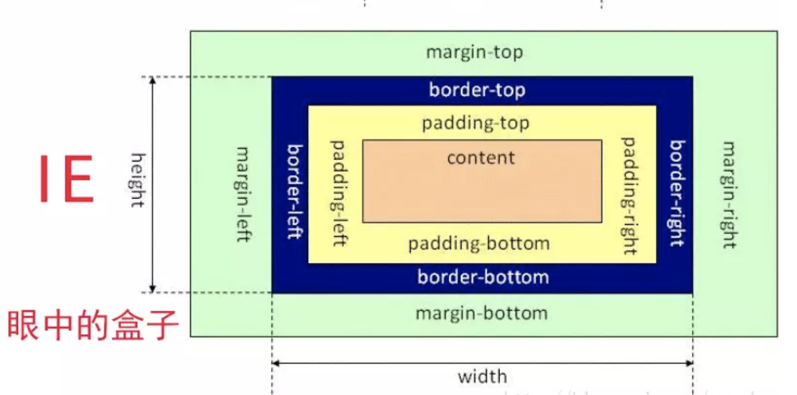

# 前端面试技巧

## 面试准备

### JD描述分析

#### 京东金融前端职位描述分析

**职位描述：**

1. 负责京东金融企业业务PC端和移动端相关的前端开发工作。

   > - 该岗位要求PC与移动开发相互交叉，即该岗位至少负责PC端和移动端两项内容。
   > - 面试中可能会考察PC端和移动端两种技术栈双方面的知识。

2. 负责企业金额APP H5开发，完成前端界面与后端交互开发。

   >- Hybrid技术栈、与Native客户端没有交互的纯H5开发(活动、专题)
   >- 可能会包含动画、3D

3. 负责与后端工程师沟通协作，调试接口数据。

   > - 数据Mock

4. 负责京东金融前端组件库的建立。

   > - 这条要求很重要，是对该岗位的难度设立，需要基本功扎实(对原生JS、CSS的理解是否到位)
   > - 前端组件库的建立的经验
   > - 是否通读过其他UI组件库的源码

5. 负责对现有系统的优化和重构。

**任职要求：**

1. 3年以上相关工作经验，精通HTML5特性，了解HTML5最新规范，能够熟练运用HTML5特性构建移动端的WebApp。

   > - 不必纠结于3年的时间要求，只要有相应的工作经验就可以去面试。
   > - 对HTML5的相关要求说明移动端在该技术团队中是很重视的。
   > - 精通特性、了解最新规范 说明希望你是对新知识有技术追求的。

2. 熟悉当前流行的 JavaScript 类库，熟悉 JavaScript 面向对象编程方法。

   > - 面对对象的编程方式，以及原型链、类、继承、ES6的相关知识。

3. 熟悉 Web标准，对数据和表现分离、HTML语义化等有一定理解，至少熟悉一种前端MVC框架并且有实际经验( 不限 React、Angular、Vue等)

   > - Web标准熟悉最新的即可，会ES6，对数据和表现分离，可通过做两个简单的小项目来进行演示。
   > - 写HTML时一定要严格的按照语义化使用标签，不要一直嵌套div。
   > - 学习过，用过框架不代表熟悉，没有实际做过项目的话也要最起码准备几个开发中常碰到的问题。

4. 具有前端架构分析与设计能力，一贯坚持编写易读，易维护、高质量、高效率的代码，习惯于OOP开发方式。

   > - 该条任职要求不是为工作一到两年的初级前端工程师准备的，可从公司目前的想买开始着手思考
   > - 项目的目录结构设计、复用性设计、模块化设计、自动化测试、上线流。这些方面都要分析考虑周到，才能具有架构分析与设计的能力。
   > - 笔试写代码时，一定要坚持好的编码习惯。每个函数的功能要单一，能抽象的尽量抽象。

5. 对用户可用性，用户体验，用户研究等相关知识有深入的了解和实践经验。

   > - 考察的不是技术本身，而是对产品的感觉。
   > - 可以总结对做过的项目有哪些改进，在完成功能的基础上增强用户体验。

6. 对Web前端技术有强烈兴趣，能对 Web前沿技术研究和技术调研，有良好的学习能力和团队合作能力。

   > - 在GIthub上关注最流行的前端项目和框架、多浏览技术博客，扩展自己的知识面。

7. 了解 CSS预编译语言如 sass、less等。

8. 熟悉web构建工具 Grunt、Gulp、能够自己搭建前端构建环境。

   > - 熟悉使用Gulp构建工具，要知道Grunt和Gulp有什么区别。

9. 有服务端(不限语言)开发经验者优先。

   > - 了解即可，既然前面没有提到对服务端的要求，不用可以去学Node.js给自己挖坑。

#### 艺龙前端职位描述分析

**职位描述：**

1. 负责艺龙酒店业务前端开发，使用系统化设计提高开发效率。

   > - 说法比较笼统，系统化设计提高开发效率其实就是模块化设计以及前后端分离(客户端渲染)

2. 负责推广运营活动的html5、采用canvas、css3、JS 相关前端技术。

   > - 没有明确指出html5页面是放在PC还是移动端，但是明确了canvas和css3做动画的技术点。
   > - 对动画应该会有一定的要求，所以起码应该了解画图相关的API、animation、transition、还有动画帧和GPU加速。

3. 负责艺龙微信项目。

   > - 微信小程序相关开发文档以及组件化的东西、微信支付等微信开发中常见的技术点。

4. 艺龙前端框架的开发和维护，协助业务方解决应用问题。

   > - 熟悉框架、组件化开发设计。

**任职要求：**

1. 精通各种Web前端技术，包括HTML/CSS/JavaScript等，3年以上工作经验。

2. 深刻理解Web标准，对可用性、可访问性等相关知识有实际的了解和实践经验。

   > - 对网站错误及性能相关方面的监控，捕获 JS 异常(JS运行异常、资源加载错误)

3. 熟练使用工程化工具，熟悉webpack、grunt、sass优先。

4. 具有良好的代码风格、接口设计与程序架构。

5. 至少熟悉一门非Web前端脚本的语言(如 Java / Python) 或Node.js，有实践经验。

6. 个性乐观开朗、逻辑性强、善于和各种背景的人合作。

### 技术栈准备

#### 前端技术核心

**jQuery**

1. 阅读源码：核心架构是什么、事件委托怎么做的、插件机制是什么？兼容性也可以了解一下
2. 找一些比较详细的源码解读博客和文章，仔细阅读，深入理解，明白其中原理。

**Angular、Vue、React**

1. 根据自己的兴趣准备其中的一两个框架，并深入理解掌握其中一个。
2. 阅读源码：不建议自己阅读，找一些高质量的文章跟着学习。 
3. 项目实战：在写项目的过程中积累遇到过的问题，以及面试中常见的坑可以在社区论坛中找到解决方案。

**Node.js**

1. 如果没有了解过就选择不要在简历中出现Node.js，避免给自己挖坑。
2. 如果自己能够有一定的了解，则可以成为面试的加分项。

#### 前端工程

**sass、less**

1. 预编译语言，根据自己的兴趣或面试公司是的技术团队来选择掌握一种。

**Gulp、Grunt**

1. 如果两个都没有学过的话，建议去了解Gulp。

**npm**

1. 应该掌握常见的npm命令。

**webpack**

1. webpack的知识比较多，可以去webpack中文网学习。

### 自我介绍

#### 简历

1. 基本信息：姓名、年龄、手机、邮箱、籍贯（照片几乎不需要）
2. 学历：只保留最高学历即可
3. 工作经历：时间-公司-岗位-技术栈-业绩（技术方案带来的业务收益和技术收益）
4. 开源项目：Github和说明

#### 自我陈述

1. 把握面试的沟通方向

   > 在陈述过程中，决定自己该说哪些，不该说哪些。
   >
   > 把自己善于的技术点表达出来，而不是提到自己不熟悉的方面。

2. 豁达、自信的适度发挥

   > 没有气场的沟通基本是无效的，但如果即使谈到了自己准备的方面，也不要膨胀。
   >
   > 目的是要让面试官欣赏你，而不是你觉得对方不如你，适度发挥即可。

## 模拟一面

- 准备要充分
- 知识要系统
- 沟通要简洁
- 内心要诚实
- 态度要谦虚
- 回答要灵活

### 面试技巧 页面布局类

**常见问题：多种方式实现三栏布局**

### CSS盒模型 DOM事件类

#### CSS盒模型

**面试问题：谈谈你对CSS盒模型的认识。**

1. 基本概念：标准模型 + IE模型

   

   

2. 标准模型和IE模型的区别

   > 标准模型的宽度就是指content的宽度，不包含padding和border。
   >
   > 而IE盒模型是计算border 和padding 的。

3. CSS如何设置这两种模型

   > 利用css3的box-sizing属性
   >
   > - box-sizing: content-box; (默认为标准)
   > - box-sizing: border-box; (IE)

4. JS如何设置获取盒模型的宽和高

   > Dom.style.width/height(内联样式的宽高)
   >
   > Dom.currentStyle.width/height(页面渲染后的宽高，只有IE支持)
   >
   > Window.getComputedStyle(dom).width/height(页面渲染后的宽高，兼容chrome、firefox) 
   >
   > Dom.getBoundingClientRect().width/height(可返回相对视窗的left、top、width、height)

5. 实例题（根据盒模型解释边距重叠）

   ```html
   <section id="sec">
       <style media="screen">
           html {
               padding: 0;
               margin: 0; 
           }
           #sec {
               background: red;
               overflow: hidden;
           }
           .child {
               height: 100px;
               margin-top: 10px;
               background: yellow;
           }
       </style>
       <article class="child">
       
       </article> 
   </section>
   ```

   > section高度等于其子元素article的高度100px，加上overflow: hidden;属性为其创建块级格式化上下文BFC，则高度变为110px。

6. BFC（边距重叠解决方案）

   > - BFC的基本概念
   > - BFC的原理
   > - 如何创建BFC 
   > - BFC的使用场景

   ```html
   <!--BFC垂直方向边距重叠-->
   <section id="margin">
       <style>
           #margin {
               background: pink;
               overflow: hidden;
           }
           #margin p {
               margin: 10px auto 25px;
               background: red;
           }
       </style>
       <p>1</p>
       <!--为了去掉垂直方向的边距重叠，可以给子元素加一个div并将其变成BFC。-->
       <div style="overflow: hidden;">
           <p>2</p>
       </div>
       <p>3</p>
   </section>
   ```

   ```html
   <!--BFC不与float重叠-->
   <section id="layout">
       <style media="screen">
           #layout {
               background: red;
           }
           #layout .left {
               float: left;
               width: 100px;
               height: 100px;
               background: pink;
           }
           #layout .right {
               height: 110px;
               /*因为左侧left浮动，右侧区域会侵占左侧显示高出来的10px*/
               /*所以利用overflow: auto;将右侧变成BFC*/
               overflow: auto;
               background: #ccc;
           }
       </style>
       <div class="left"></div>
       <div class="right"></div>
   </section>
   ```

   ```html
   <!--BFC子元素即使是float也会参与高度计算-->
   <section id="float">
       <style media="screen">
           #float {
               background: red;
               /*因为子元素div浮动，所以section的高度为0*/
               /*将其变成BFC清除浮动，使其计算子元素的高度也参与计算*/
               overflow: auto;
               /*float: left;*/
           }
           #float .float {
               float: left;
               font-size: 30px;
           }
       </style>
       <div class="float">我是浮动元素</div>
   </section>
   ```

#### DOM事件类

1. 基本概念：DOM事件的级别

   > DOM0	element.onclick = function(){}
   >
   > DOM2	element.addEventerListener('click', function(){}, false)
   >
   > DOM3	element.addEventerListener('keyup', function(){}, false)

2. DOM事件模型、事件流

   > 从上而下：捕获、从下而上：冒泡

3. 描述DOM事件捕获的具体流程

   > Window—> document —> html —> body ... —> 目标元素

4. Event对象的常见应用

   > Event.preventDefault()	阻止默认事件
   >
   > Event.stopPropagation()	阻止冒泡
   >
   > Event.stopImmediatePropgagation()	
   >
   > 如果有多个相同类型事件的事件监听函数绑定到同一个元素，当该类型的事件触发时，它们会按照被添加的顺序执行。如果其中某个监听函数执行了该方法，则当前元素剩下的监听函数将不会被执行。​	
   >
   > Event.target	标识事件发生的元素
   >
   > Event.currentTarget
   >
   > 当事件遍历DOM时，标识事件的当前目标。它总是引用事件处理程序附加到的元素，而不是event.target。

5. 自定义事件

   > ```js
   > var eve = new Event('custome') // 声明自定义事件
   > ev.addEventListener('custome', function(){ // 在Dom节点上绑定自定义事件
   >     console.log('custome')
   > })
   > ev.dispatchEvent(eve) // 触发自定义事件
   > // Event自定义事件方法只能指定事件名，如果需要件传递参数 则需要使用CustomeEvent
   > ```

 ### HTTP协议类 原型链类 

#### HTTP协议类

1. HTTP协议的主要特点

   > 简单快速：每个资源URI统一资源符都是固定的
   >
   > 灵活： 通过设置HTTP协议头部的数据类型，可以完成不同类型数据的传输
   >
   > 无连接：连接一次就会断掉，不会保持连接
   >
   > 无状态：建立的每次连接都不记录状态

2. HTTP报文的组成部分

   > 请求报文：请求行、请求头、空行、请求体
   >
   > 响应报文：状态行、响应头、空行、响应体 

3. HTTP方法

   > GET、POST、PUT、DELETE、HEAD(获得报文首部)

4. POST和GET的区别

   > - GET在浏览器回退时是无害的，而POST会再次提交请求
   > - GET产生的URL地址可以被收藏，而POST不可以
   > - GET通过URL传递参数，POST放在Request body中
   > - GET比POST更不安全，因为参数直接暴露在URL上，所以不能用来传递敏感信息
   > - GET请求参数会被完整保留在浏览器历史记录里，而POST中的参数不会被保留
   > - GET请求在URL中传送的参数是有长限制的，而POST没有限制
   > - GET请求会被浏览器主动缓存，而POST不会，除非手动设置
   > - GET只能进行url编码，而POST可以支持多种编码方式
   > - 对参数的数据类型，GET只接受ASCII字符，而POST没有限制

5. HTTP状态码

   > - 1xx：指示信息、表示请求已接收，继续处理
   > - 2xx：成功、表示请求已被成功接收
   > - 3xx：重定向、要完成请求必须进行更进一步的操作
   > - 4xx：客户端错误、请求有语法错误或请求无法实现
   > - 5xx：服务端错误、服务器未能实现合法的请求

6. 什么是持久连接

   > HTTP协议采用“请求-应答”模式，当使用普通模式，即非Keep-Alive模式时，每个请求/应答客户和服务器都要新建一个连接，完成之后立即断开连接(HTTP协议为无连接的协议)。
   >
   >
   >
   > 当使用Keep-Alive模式(又称持久连接、连接重用)时，Keep-Alive功能使客户端到服务端的连接持续有效，当出现对服务器的后继请求时，Keep-Alive功能避免了建立或者重新建立连接。

7. 什么是管线化

   > 在使用持久连接的情况下，某个连接上消息的传递类似于
   >
   > 请求1->响应1->请求2->响应2 ->请求3->响应3
   >
   > 管线化是指连接通道是持久建立的，但是将请求进行打包后一次传输过去，响应同理
   >
   > 请求1->请求2->请求3->响应1->响应2->响应3

   - 管线化机制通过持久连接完成，仅HTTP/1.1支持此技术
   - 只有GET和HEAD请求可以进行管线化，而POST则有所限制
   - 初次创建连接时不应启动管线机制，因为对方(服务器)不一定支持HTTP/1.1版本的协议
   - 管线化不会影响响应到来的顺序，如上面的例子所示，响应返回的顺序并未改变
   - HTTP/1.1要求服务端支持管线化，但并不要求服务端也对响应进行管线化处理，只是要求对于管线化的请求不失败即可
   - 由于上面提到的服务端问题，开启管线化很可能并不会带来大幅度的性能提示，而且很多服务端和代理程序对管线化的支持并不好，因此现代浏览器如Chrome何Firefox默认并未开启管线化支持

   > 如果面试官提到了管线化，那么可以说出它的原理和特点即可，基本工作原理即上面例子中提到的打包请求和响应。
   >
   >  特点记住前三个特点即可，如果面试官继续问细节，直接告诉他这一块没有仔细研究过，因为在业务中我了解的这些已经够用了。可以问一下面试官有什么好的资料，以后补充一下这些细节。

#### 原型链类

1. 创建对象有几种方法

   > ```javascript
   > var o = {name: 'o'}
   > var o1 = new Object({name: 'o1'})
   > // 通过字面量创建和通过new Object创建 归为一类
   > ```
   >
   > ```javascript
   > var M = function(){
   >     this.name = 'o2'
   > }
   > var o2 = new M()
   > // 通过显式的构造函数来创建对象
   > ```
   >
   > ```javascript
   > var P = {name: 'o3'}
   > var o3 = Object.create(P)
   > // Object.create()
   > ```

2. 原型、构造函数、实例、原型链

   

3. instanceof 的原理

   

4. new 运算符

   > - 一个新对象被创建，它继承自foo.prototype
   > - 构造函数foo被执行，执行的时候，相应的传参会被传入，同时上下文(this)会被指定为这个新实例。new foo 等同于new foo()，只能用在不传递任何参数的情况。
   > - 如果构造函数返回了一个“对象”，那个这个对象会取代new出来的结果。如果构造函数没有返回对象，那么new出来的结果为步骤1创建的对象。

### 面向对象类 通信类

#### 类与实例

**类的声明**

```javascript
// ES5
function Animal(){
    this.name = 'name'
}
// ES6
class Animal2(){
    constructor() {
        this.name = 'name'
    }
}
```

**生成实例**

```javascript
console.log(new Animal, new Animal2)
```

#### 类与继承

**如何实现继承**

```javascript
// 借助构造函数实现继承
function Parent1() {
    this.name = 'parent1'
}{}
Parent1.prototype.say = function() {}
function Child1() {
    Parent1.call(this) // apply改变函数运行的上下文
    this.type = 'child1'
}
// 缺点是Parent1原型链上的属性是没法被Child1继承的
// console.log(new Child1().say())会报错
```

```javascript
// 借助原型链实现继承
function Parent2() {
    this.name = 'parent2'
    this.play = [1, 2, 3]
}{}
function Child2() {
    this.type = 'child1'
}
Child2.prototype = new Parent2() // 将Child2的prototype设为Parent2的实例对象
console.log(new Child2()) // 可以看到child2的_proto_属性指向Parent2并且还有name和play属性
// 缺点是原型链中的原型对象是共享的，即s1._proto_ === s2._proto_(引用的都是同一个原型对象)
var s1 = new Child2()
var s2 = new Child2()
s1.play.push(4)
console.log(s1.play, s2.play) // [1, 2, 3, 4] [1, 2, 3, 4] 
```

```javascript
// 组合方式实现继承
function Parent3() {
    this.name = 'parent3'
    this.play = [1, 2, 3]
}
function Child3() {
    Parent3.call(this) // 父类构造函数执行1次
    this.type = 'Child3'
}
Child3.prototype = new Parent3() // 父类构造函数执行2次
var s3 = new Child3()
var s4 = new Child3()
s3.play.push(4)
console.log(s3.play, s4.play) // [1, 2, 3, 4] [1, 2, 3] 
// 通过组合的方式结合上面两种方式的优点，并弥补了它们的不足，是很通用的方式。
// 缺点：子类实例化时父类的构造函数会执行两次
```

```javascript
// 组合方式继承的优化
function Parent4() {
    this.name = 'parent4'
    this.play = [1, 2, 3]
}
function Child4() {
    Parent4.call(this) // 父类构造函数执行1次
    this.type = 'Child4'
}
Child4.prototype = Parent4.prototype // 直接引用父类的原型对象：想继承父类的原型对象，所以直接将其赋值给当前的原型对象即可，这样既可以拿到其构造体内的属性和方法，也可以拿到原型对象上的属性和方法。
var s5 = new Child4()
var s6 = new Child4()
console.log(s5, s6)
```


**继承的几种方式**

### 前端安全类 前端算法类

## 模拟二面

###  面试技巧

### 渲染机制类

### JS运行机制

### 页面性能

### 错误监控

## 模拟三面

### 面试技巧

### 业务能力

### 团队协作能力

### 带人能力

## 模拟终面

### 面试技巧

### 职业竞争力

### 职业规划

## 课程总结

### 注意事项

### 复习指南


